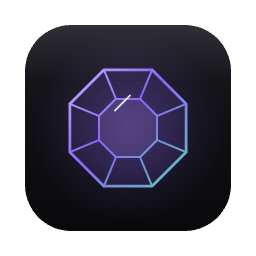
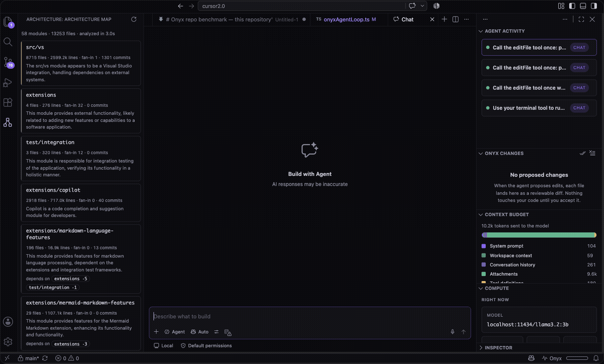
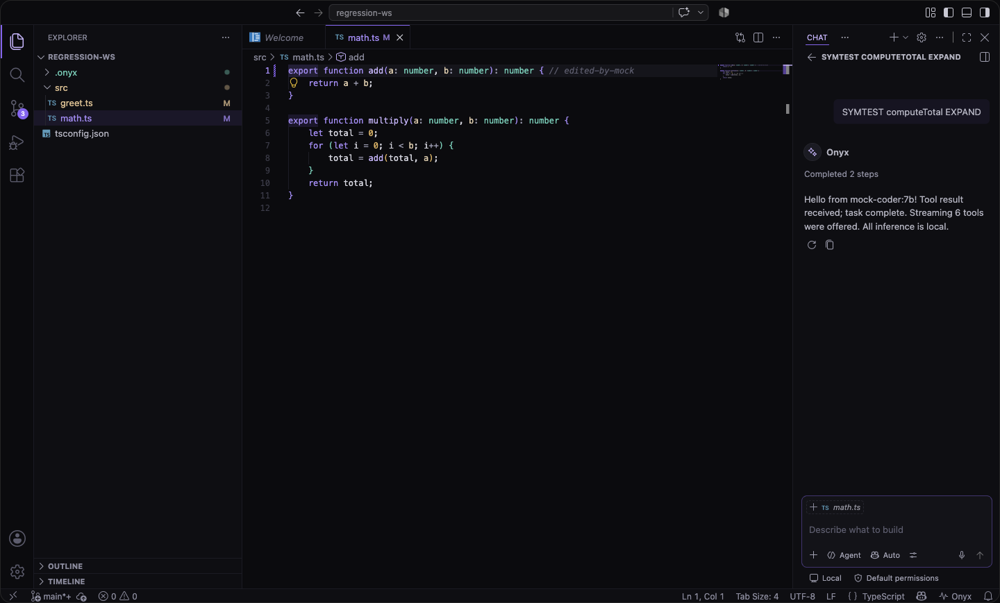
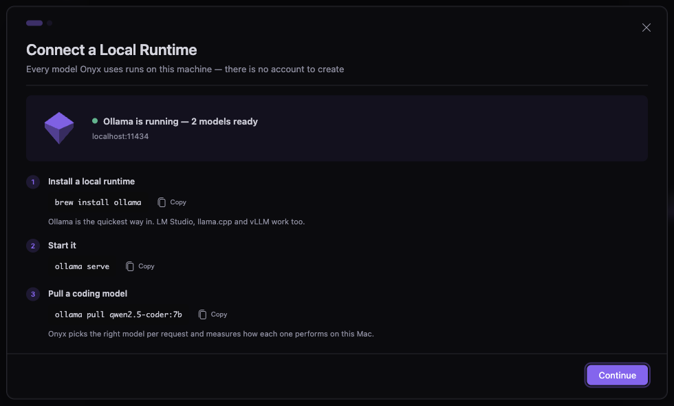
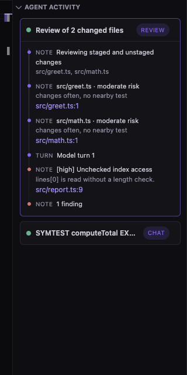
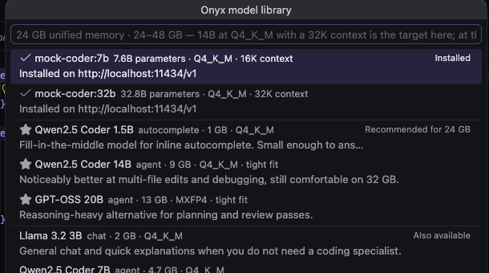
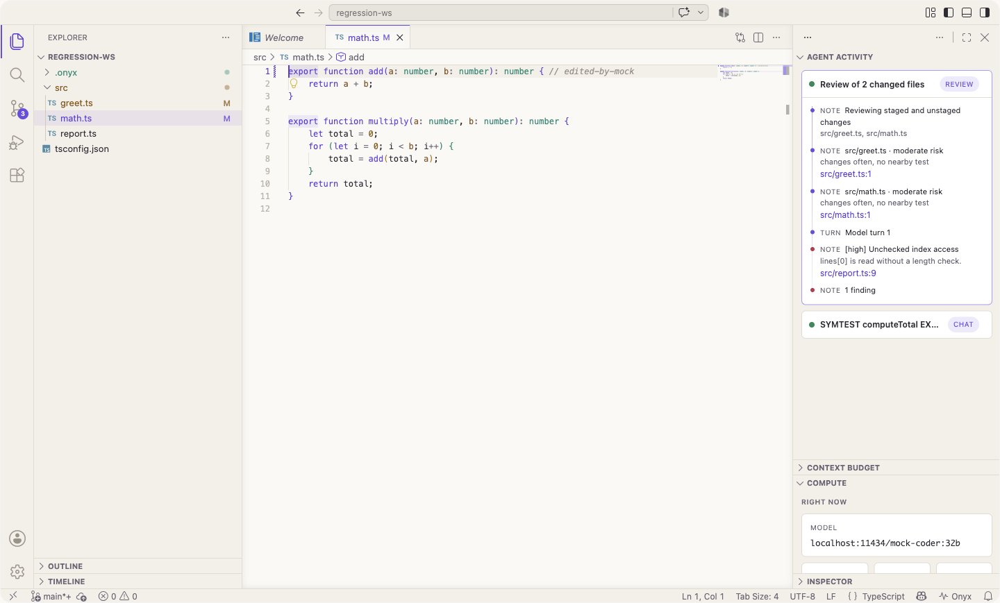

<p align="center">
  
</p>

<h1 align="center">Onyx</h1>

<p align="center"><b>The local-first AI code editor for macOS.</b><br/>
Every model runs on your machine. No cloud. No telemetry. No account —
there is nothing to sign in to.</p>

<p align="center">
  
</p>
<p align="center"><i>Recorded from the real product against real local models — no cloud, no cuts.</i></p>

<p align="center">
  
</p>

<p align="center">
  
</p>
<p align="center"><i>First run. There is no account step — the only thing to set up is a model on your machine.</i></p>

<p align="center">
  
</p>
<p align="center"><i>The control plane: every step the agent took, why it took it, and where the findings live.</i></p>

<p align="center">
  
</p>
<p align="center"><i>The model library reads this Mac's unified memory and recommends accordingly.</i></p>

<p align="center">
  
</p>
<p align="center"><i>Compute spent, per model, for this session and all time.</i></p>

<p align="center">
  
</p>
<p align="center"><i>Onyx Light — the same violet and teal, on warm paper.</i></p>

Onyx is a fork of [Code - OSS](https://github.com/microsoft/vscode) whose
**entire agent architecture is designed around local inference**. Think
Cursor — except inference happens on your hardware through any
OpenAI-compatible runtime (Ollama, LM Studio, llama.cpp, vLLM), a 7B model
gets a different harness than a 70B model, and a visual control plane shows
exactly what the agent is doing and why.

## Why Onyx is different

- **Local-first is architectural, not a provider option.** One
  OpenAI-compatible client covers every runtime; discovery finds your
  models automatically and nothing you type leaves the machine.
- **The harness adapts to the model.** Prompt style, tool count,
  temperature, and context budget derive from a per-model capability
  profile — seeded from model metadata, sharpened by measurements taken on
  *your* hardware and by which answers *you* keep.
- **Auto routing that actually learns.** Quick edits go to fast small
  models, implementation and debugging to your strongest tool-callers,
  based on measured tok/s, tool-call reliability, and accept rates.
- **Everything is observable.** The Onyx Control Plane (`⌘⌃O`) streams
  every routing decision, model turn, and tool call live — with pause,
  stop, and redirect — plus a token-exact context budget, compute costs
  (tok/s, TTFT), and an inspector that replays any past run down to the
  exact wire prompt.
- **Repo intelligence, no cloud index.** A symbol-aware retrieval tool
  built on the editor's own language services (with call-graph expansion),
  context ranking from open editors + git recency, and persistent
  per-workspace agent memory.
- **Trust, but verify.** After the agent edits code, Onyx diffs workspace
  problems against the pre-run baseline and can run your project's own
  build/test task, posting the verdict to the timeline.
- **Local autocomplete.** Ghost text from your smallest, fastest model via
  fill-in-the-middle, with cross-file context and latency-aware model
  selection.
- **A model library that knows your Mac.** `Onyx: Manage Models` reads
  unified memory and tells you which models actually fit — with the
  quantization and context window to run them at — then pulls them with
  one click and live progress.
- **Compute is the local bill.** A per-model ledger for this session and
  all time: requests, tokens, average tok/s and time-to-first-token,
  accept rate, and a `B·s` energy proxy — billions of parameters held for
  seconds of generation.
- **Local commit messages and local review.** Generate a commit message
  from the staged diff without leaving the SCM input, and run
  `Onyx: Review My Changes` to put your working tree past an adversarial
  reviewer whose findings land on the timeline as clickable `file:line`
  links. The reviewer reports; it never edits.
- **Two commands in the editor.** **Fix with Onyx** on a diagnostic and
  **Explain with Onyx** on a selection, both routed through the normal
  chat surface with the right range attached.
- **Inline edit that survives small models (`⌘I`).** Select code, say what
  to change, and the edit streams back as reviewable hunks: `⌘⏎` keeps
  one, `⌘⌫` restores the original lines, `F7` walks them. Local models
  mangle unified diffs, so Onyx asks for SEARCH/REPLACE blocks and repairs
  what comes back — echoed markers, missing dividers, whitespace drift,
  truncated output. When nothing usable can be parsed, your file is left
  exactly as it was and the widget says so.
- **Tournament mode.** `Onyx: Run in Parallel` races one instruction across
  several local models, each in its own `git worktree` so nothing collides.
  Compare the diffs side by side, pick a winner — it is applied to your
  tree, the rest are discarded, and the pick teaches the router.
- **Constrained decoding where the runtime supports it.** Models that keep
  mangling tool calls get their turns constrained to a JSON schema, and the
  Compute view shows the malformed-call rate free-form versus constrained.
- **Prompt-cache-aware prompting.** A stable system prefix, append-only
  history and volatile context last, with a live readout of how many prompt
  tokens the runtime could reuse and what that buys in first-token latency.
- **Battery and heat are inputs.** On battery or under thermal pressure the
  router caps model size and autocomplete backs off, and the Compute view
  explains the downshift in one plain sentence.
- **Semantic search without embeddings.** An incremental BM25 index over
  your workspace, blended with symbol matches and co-change history — it
  finds "commit message digest" in the file that defines
  `buildCommitDiffDigest`, which substring search never will.
- **Risk badges before you accept.** Each changed file is scored on churn,
  coupling, call-graph fan-in, hunk size and test proximity, and shown as a
  calm one-line reason — never a wall of red.
- **A configuration your repository can check in.** `.onyx/config.json`
  pins models per task kind, the verification task, context pins, a review
  severity threshold and disabled tools — schema-backed, and always
  outranked by your own settings.
- **Everything in one place (`⌘⌃H`).** The Onyx Hub fronts every command
  with live state: models ready, runs today, which model is resident.

## Getting started

```bash
# Requires Node 24 and a local model runtime (e.g. `brew install ollama`)
git clone https://github.com/sheehanlloyd/cursor2.0.git onyx && cd onyx
npm i
npm run compile
./scripts/code.sh
```

Start Ollama (or LM Studio / llama.cpp / vLLM), open chat, and pick
**Auto** — or any discovered model — in the model picker. The **Get Started
with Onyx** walkthrough on the Welcome page tours the rest.

Building a distributable, signed macOS app: see [LAUNCH.md](./LAUNCH.md).

## Testing

```bash
./scripts/test.sh --grep Onyx      # unit tests for the pure logic
node test/onyx/mock-ollama.mts     # an OpenAI-compatible mock, no model needed
node test/onyx/run-e2e.mts         # drives the workbench, asserts on the run journal
```

See [test/onyx/README.md](./test/onyx/README.md) for the mock's prompt markers.

## Architecture

The product plan, full architecture, and status live in
[ONYX.md](./ONYX.md). The fork stays cleanly rebaseable on upstream VS
Code: all Onyx code is additive (new directories, a built-in theme
extension), and the handful of one-line upstream touch points are
documented in [REBASE.md](./REBASE.md).

## License

MIT, like the [Code - OSS](https://github.com/microsoft/vscode) project it
builds on. Copyright (c) Microsoft Corporation and Onyx contributors.
