<p align="center">
  
</p>

<h1 align="center">Onyx</h1>

<p align="center"><b>The local-first AI code editor for macOS.</b><br/>
Every model runs on your machine. No cloud. No telemetry. No account —
there is nothing to sign in to.</p>

<p align="center">
  
</p>
<p align="center"><i>Recorded from the real product against real local models — no cloud, no cuts.</i></p>

<p align="center">
  
</p>

<p align="center">
  
</p>
<p align="center"><i>First run. There is no account step — the only thing to set up is a model on your machine.</i></p>

<p align="center">
  
</p>
<p align="center"><i>The control plane: every step the agent took, why it took it, and where the findings live.</i></p>

<p align="center">
  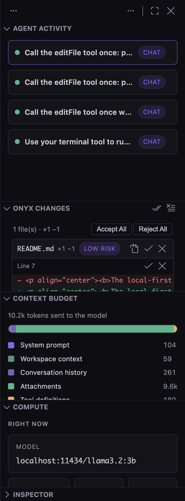
</p>
<p align="center"><i>Agent edits stage here first. Per-file and per-hunk accept or reject — your code only changes by your decision.</i></p>

<p align="center">
  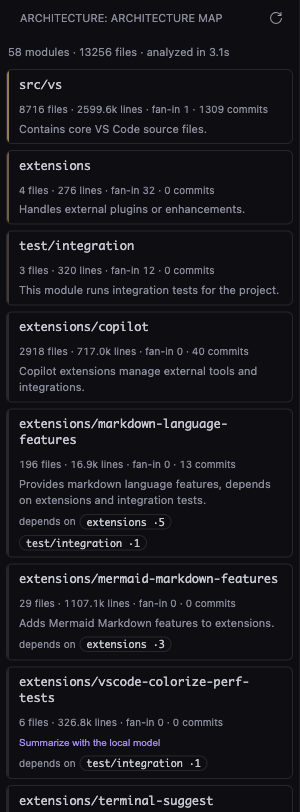
</p>
<p align="center"><i>The architecture map on this repository: 13,256 files become 58 modules in 3.1 seconds, each with a one-line summary written by a model on this Mac.</i></p>

<p align="center">
  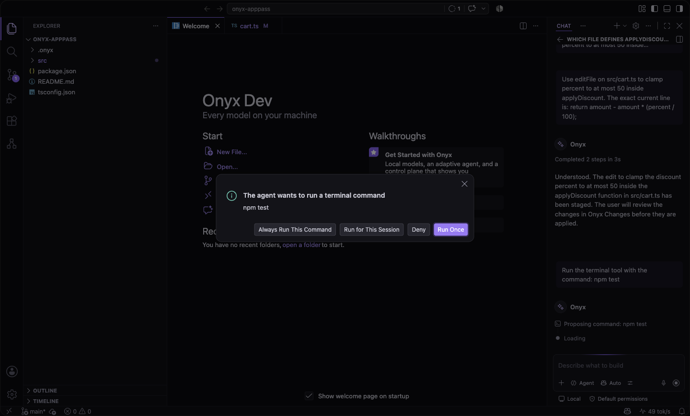
</p>
<p align="center"><i>The agent cannot run anything by itself. Dangerous commands are named as such and never get an "always" option.</i></p>

<p align="center">
  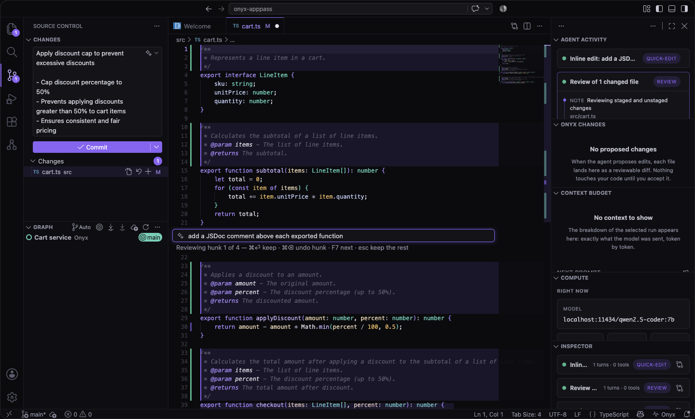
</p>
<p align="center"><i>⌘I inline edit. A 7B model's change arrives as reviewable hunks — ⌘⏎ keeps one, ⌘⌫ puts the original lines back.</i></p>

<p align="center">
  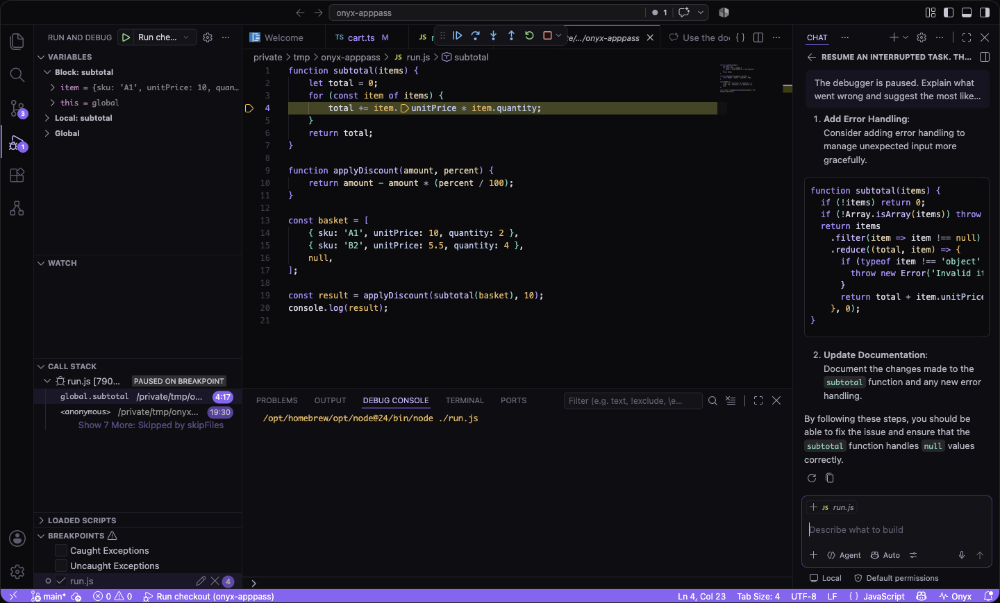
</p>
<p align="center"><i>Paused at a real breakpoint: the stack and the actual variable values go into a request you can read, and the local model finds the null in the array.</i></p>

<p align="center">
  
</p>
<p align="center"><i>The model library reads this Mac's unified memory and recommends accordingly.</i></p>

<p align="center">
  
</p>
<p align="center"><i>Compute spent, per model, for this session and all time.</i></p>

<p align="center">
  
</p>
<p align="center"><i>Onyx Light — the same violet and teal, on warm paper.</i></p>

Onyx is a fork of [Code - OSS](https://github.com/microsoft/vscode) whose
**entire agent architecture is designed around local inference**. Think
Cursor — except inference happens on your hardware through any
OpenAI-compatible runtime (Ollama, LM Studio, llama.cpp, vLLM), a 7B model
gets a different harness than a 70B model, and a visual control plane shows
exactly what the agent is doing and why.

## Why Onyx is different

- **Local-first is architectural, not a provider option.** One
  OpenAI-compatible client covers every runtime; discovery finds your
  models automatically and nothing you type leaves the machine.
- **The harness adapts to the model.** Prompt style, tool count,
  temperature, and context budget derive from a per-model capability
  profile — seeded from model metadata, sharpened by measurements taken on
  *your* hardware and by which answers *you* keep.
- **Auto routing that actually learns.** Quick edits go to fast small
  models, implementation and debugging to your strongest tool-callers,
  based on measured tok/s, tool-call reliability, and accept rates.
- **Everything is observable.** The Onyx Control Plane (`⌘⌃O`) streams
  every routing decision, model turn, and tool call live — with pause,
  stop, and redirect — plus a token-exact context budget, compute costs
  (tok/s, TTFT), and an inspector that replays any past run down to the
  exact wire prompt.
- **Repo intelligence, no cloud index.** A symbol-aware retrieval tool
  built on the editor's own language services (with call-graph expansion),
  context ranking from open editors + git recency, and persistent
  per-workspace agent memory.
- **Trust, but verify.** After the agent edits code, Onyx diffs workspace
  problems against the pre-run baseline and can run your project's own
  build/test task, posting the verdict to the timeline.
- **Local autocomplete.** Ghost text from your smallest, fastest model via
  fill-in-the-middle, with cross-file context and latency-aware model
  selection.
- **A model library that knows your Mac.** `Onyx: Manage Models` reads
  unified memory and tells you which models actually fit — with the
  quantization and context window to run them at — then pulls them with
  one click and live progress.
- **Compute is the local bill.** A per-model ledger for this session and
  all time: requests, tokens, average tok/s and time-to-first-token,
  accept rate, and a `B·s` energy proxy — billions of parameters held for
  seconds of generation.
- **Local commit messages and local review.** Generate a commit message
  from the staged diff without leaving the SCM input, and run
  `Onyx: Review My Changes` to put your working tree past an adversarial
  reviewer whose findings land on the timeline as clickable `file:line`
  links. The reviewer reports; it never edits.
- **Two commands in the editor.** **Fix with Onyx** on a diagnostic and
  **Explain with Onyx** on a selection, both routed through the normal
  chat surface with the right range attached.
- **Inline edit that survives small models (`⌘I`).** Select code, say what
  to change, and the edit streams back as reviewable hunks: `⌘⏎` keeps
  one, `⌘⌫` restores the original lines, `F7` walks them. Local models
  mangle unified diffs, so Onyx asks for SEARCH/REPLACE blocks and repairs
  what comes back — echoed markers, missing dividers, whitespace drift,
  truncated output. When nothing usable can be parsed, your file is left
  exactly as it was and the widget says so.
- **Tournament mode.** `Onyx: Run in Parallel` races one instruction across
  several local models, each in its own `git worktree` so nothing collides.
  Compare the diffs side by side, pick a winner — it is applied to your
  tree, the rest are discarded, and the pick teaches the router.
- **Constrained decoding where the runtime supports it.** Models that keep
  mangling tool calls get their turns constrained to a JSON schema, and the
  Compute view shows the malformed-call rate free-form versus constrained.
- **Prompt-cache-aware prompting.** A stable system prefix, append-only
  history and volatile context last, with a live readout of how many prompt
  tokens the runtime could reuse and what that buys in first-token latency.
- **Battery and heat are inputs.** On battery or under thermal pressure the
  router caps model size and autocomplete backs off, and the Compute view
  explains the downshift in one plain sentence.
- **Semantic search without embeddings.** An incremental BM25 index over
  your workspace, blended with symbol matches and co-change history — it
  finds "commit message digest" in the file that defines
  `buildCommitDiffDigest`, which substring search never will.
- **Risk badges before you accept.** Each changed file is scored on churn,
  coupling, call-graph fan-in, hunk size and test proximity, and shown as a
  calm one-line reason — never a wall of red.
- **A configuration your repository can check in.** `.onyx/config.json`
  pins models per task kind, the verification task, context pins, a review
  severity threshold and disabled tools — schema-backed, and always
  outranked by your own settings.
- **Agent edits stage before they land.** Every edit the agent proposes
  goes to **Onyx Changes** — a review surface with the diff per file,
  per-hunk accept and reject, accept-all and reject-all, and a risk badge.
  Nothing touches a buffer until you say so, staged edits survive a crash,
  and if you edit the file underneath, the proposal is rebased or dropped —
  never applied somewhere it no longer fits.
- **A terminal the agent has to ask for.** The agent can propose shell
  commands; each one shows you the exact command with **Run Once / Run for
  This Session / Always Run This Command / Deny**. Commands that look
  dangerous (`rm -rf`, `curl | sh`, `sudo`, force-push, disk writes) are
  named as such and can never be added to an allowlist. "Always" persists
  into `.onyx/config.json`, output streams to the timeline, and a hard
  timeout plus a kill command end anything that hangs.
- **Documentation you already have, searchable offline.** A second index
  over your project's markdown, your dependencies' READMEs, and the JSDoc
  inside their type declarations — with a `docs` tool the agent can query
  and a control-plane note saying exactly which documents an answer used.
  No network, ever.
- **Benchmarks from your own git history.** `Onyx: Benchmark on This Repo`
  turns real past commits into tasks: the model sees the file as it was
  plus the commit message and must reproduce the change. Scores are F1 over
  the lines the author actually wrote, and they feed the router — so "the
  router learns" is measured on *your* code, with the evidence in a
  document you can read.
- **Playbooks your repository checks in.** `.onyx/playbooks/*.md` are
  named, versionable recipes with validated frontmatter. The agent sees a
  one-line index of them and can pull one in; you can run one from the
  palette. Broken playbooks show up in the Problems panel, not as silent
  failures.
- **Interrupted work you can pick back up.** If a run crashes or you stop
  it, `Onyx: Resume an Interrupted Run` rebuilds it from the journal — the
  original request, what already happened, and an explicit list of what
  changed since: the model is gone, git HEAD moved, edits are still staged.
  No silent wrong resume.
- **The debugger, in the conversation.** While a session is paused,
  **Onyx: Explain This Failure** sends the stack, frames and variable
  values through normal chat — and the full snapshot is visible in the
  request before it goes, because nothing should be redacted silently.
- **Refactorings where the language services do the work.** Rename, extract
  function and move symbol are computed by the editor's own language
  services — correct across files — while the local model only *proposes
  names*. Results stage into Onyx Changes for review, and after you accept,
  Onyx compares problem markers against the baseline and tells you.
- **An architecture map for code you have never read.** The workspace as
  modules, with dependency edges, hot spots by churn and fan-in, and a
  one-line local-model summary each. This repository — 13,000 source files —
  maps in about three seconds, and a second time in one.
- **Speculative decoding, honestly measured.** Every runtime that supports
  it wants the draft set when the model loads — so Onyx measures your target
  as it stands, gives you the exact command for your runtime, waits while
  you enable it, then runs the identical prompt again. If there is no
  measurable difference, it says so rather than claiming a speedup.
- **Everything in one place (`⌘⌃H`).** The Onyx Hub fronts every command
  with live state: models ready, runs today, which model is resident,
  playbooks checked in, files awaiting review.

## Measured, not claimed

Every number below was produced by
[`test/onyx/run-benchmarks.mts`](./test/onyx/run-benchmarks.mts) on an Apple
silicon MacBook, against this repository and against the models actually
installed on that machine. The charts are generated from that run's JSON and
are never hand-edited, so a chart cannot drift from the number it claims to
show. [docs/BENCHMARKS.md](./docs/BENCHMARKS.md) explains what each one means
and how to reproduce it:

```bash
node test/onyx/run-benchmarks.mts        # skips the model sections if no runtime is up
```

### Local models on this Mac

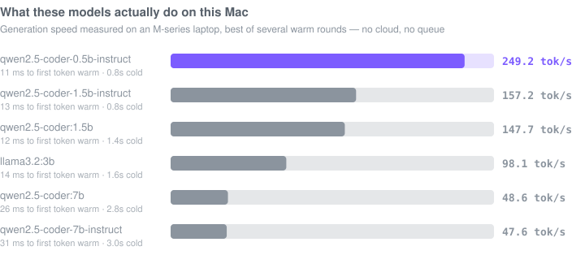

Onyx measures this itself, per model, and routes on it. Cold numbers are the
first request after the model is evicted — the price you pay for switching
models, which a benchmark that only reports warm throughput never shows you.

Measured with **one runtime on an otherwise idle machine**, which turned out to
matter more than expected: running two runtimes at once on 24 GB made the same
model read anywhere from 20 to 49 tok/s depending on what else was resident. The
harness now flags a warm time-to-first-token that exceeds its own cold one —
an impossible result that means the machine was paging, not that the model
changed. [docs/BENCHMARKS.md](./docs/BENCHMARKS.md#measure-one-runtime-at-a-time)
explains the method and what it refuses to publish.

### Small models can be made to call tools reliably

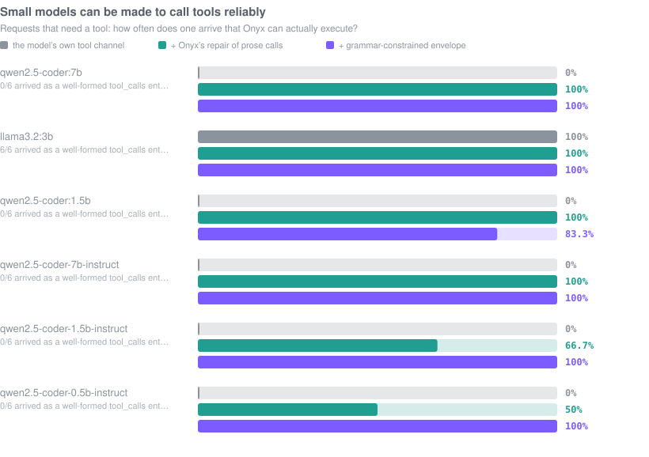

The failure that matters is not a wrong tool call, it is an *unusable* one. On
the free-form channel small models drop into prose, invent arguments, or wrap
the call in Markdown. Onyx repairs what it can, and where the runtime supports
`response_format: json_schema` it constrains the turn to a two-shape envelope
instead — call a tool, or answer.

This is the measurement that most justifies Onyx existing. Of the three models
on this machine, **two emit zero well-formed native `tool_calls` entries** —
`qwen2.5-coder` at both 7B and 1.5B scores 0%, and an agent that trusts the
runtime's tool API gets nothing usable from either. Onyx recovers a valid call
from prose in **6 of 6** requests for both, and grammar-constrained decoding
holds the weakest arm at 100% where free-form slips. The model did not get
better; the harness did.

### Which model is better at what — on your repository

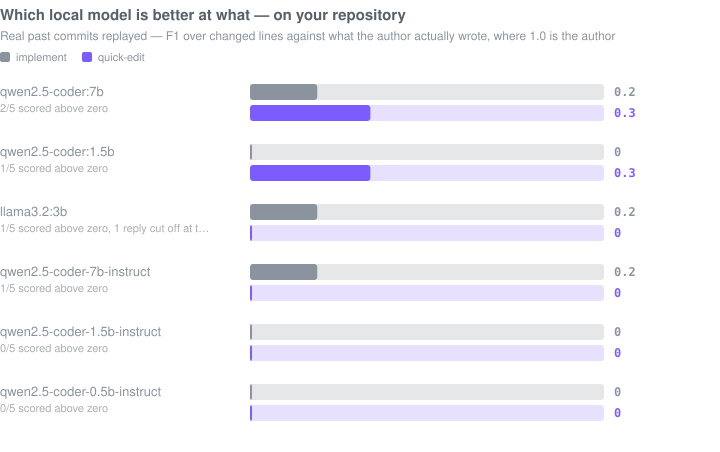

Real past commits become tasks: the model sees the file as it was plus the
commit message, and must reproduce the change. The score is F1 over the lines
the author actually wrote, where 1.0 is the author. These are hard tasks and
the numbers are small — that is the point. They are a *routing signal*, and
they say something no leaderboard can: which of *your* models is better at
which kind of work, on *your* code.

Here that signal is not "use the biggest model". The 7B leads overall (0.25 F1),
but on **quick edits the 1.5B ties it exactly** (0.34 each) while generating
three times faster — 152 tok/s against 49. Routing small edits to the small
model is free latency, and it is a conclusion no general benchmark could have
given you, because it depends on this repository and this machine. Re-run it on
yours and the ordering may differ; that is the feature.

Every model scored identically across three independent runs — the tasks are
replayed at temperature 0, so the signal is stable enough to route on rather
than noise dressed up as a score.

### Speculative decoding, measured instead of assumed

Onyx can pair a small draft model with a larger target. The interesting part is
what happened when that was actually measured on this machine, against LM Studio
0.4.23 — **it lost every time**:

| target → draft | prompt | without draft | with draft | Δ |
|---|---|---|---|---|
| 1.5B → 0.5B | prose | 90.2 tok/s | 88.3 tok/s | −2% |
| 7B → 0.5B | prose | 25.9 tok/s | 23.7 tok/s | −9% |
| 7B → 0.5B | **code** | 31.2 tok/s | 24.7 tok/s | **−21%** |

A 14× size ratio is where speculation is supposed to pay, and code is the prompt
that matters for a coding tool. The draft was provably attached — loading with a
nonexistent draft is rejected outright, so a successful load proves the pairing
took effect rather than being silently ignored. The likely cause is that both
models contend for the same unified-memory GPU, so the draft is nowhere near
free.

Onyx ships the readout, not the claim. It tells you to drop a pairing that
loses, which on this hardware is all of them.
[docs/BENCHMARKS.md](./docs/BENCHMARKS.md#speculative-decoding) has the method.

### Finding the right file from a plain-English question

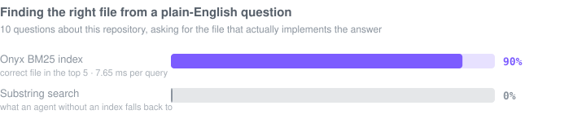

### Surviving what small local models actually emit

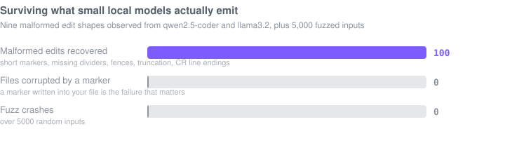

### The agent never runs a command you did not approve

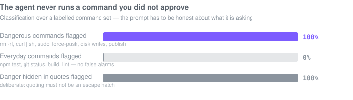

### Built for a repository you have never read

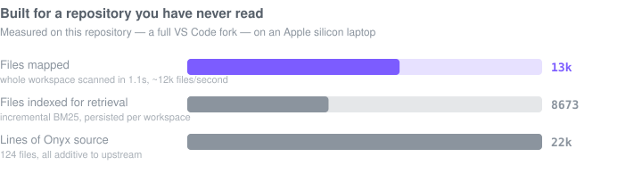

### What is actually verified

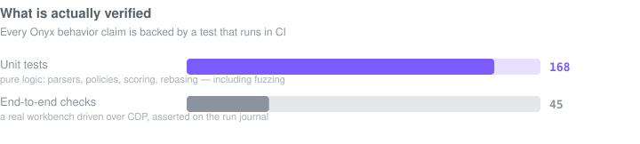

## How Onyx compares

Onyx is not trying to beat a frontier model. It is trying to be the editor
that makes a model *on your machine* useful, and to be honest about what that
costs. The comparison below is structural — it is about where inference runs
and what you are shown before something happens to your code. **No performance
numbers for other products appear here**, because none were measured; every
number in this README came from the harness above, on this machine.

| | Cloud AI editors<br/>(Cursor, Copilot) | Ollama or LM Studio<br/>on their own | Continue, Cline<br/>(extension in another editor) | **Onyx** |
|---|---|---|---|---|
| Where inference runs | The vendor's servers | Your machine | Your machine, or a cloud key | **Your machine only** |
| Account required | Yes | No | No | **No — there is nothing to sign in to** |
| Your code leaves the machine | Yes, by design | No | Depends on the model you configure | **No** |
| Agent edits before they land | Varies by product | n/a — no editor | Varies by product | **Always staged; per-hunk accept/reject; survives a crash; rebased if the file moves** |
| Shell commands | Varies by product | n/a | Varies by product | **Never runs without an explicit dialog; dangerous patterns named and un-allowlistable** |
| Which model handles a request | The vendor decides | You decide, per request | You decide, per config | **Measured on your hardware and your commits, with the reason shown** |
| Speed and cost readout | Dollars, or nothing | `--verbose` in a terminal | Varies | **tok/s, TTFT, context usage and a B·s energy proxy, per model, live** |
| Documentation lookup | The vendor's index, online | n/a | Varies | **A local BM25 mirror of your markdown, dependency READMEs and JSDoc — no network** |
| Seeing what the agent actually sent | Rarely | You wrote the request | Sometimes | **Every past run replayable down to the exact wire prompt** |
| Works with no internet | No | Yes | Depends | **Yes, entirely** |

Where Onyx is *worse*, plainly: a 7B model on a laptop is not GPT-5-class, and
no amount of harness fixes that. From this repository's own testing, with real
models:

- The adversarial reviewer was handed a diff containing `for (let i = 0; i <=
  items.length; i++)` — a textbook off-by-one dereferencing `items[items.length]`
  — and reported **"No problems found."** The diff was in the prompt; the model
  missed it.
- Asked to use the offline docs tool, qwen2.5-coder:7b answered "not explicitly
  mentioned in the project's documentation" **three times without calling the
  tool**, about a policy written in the README. In a fresh chat the same model
  called the tool and got it right — its own earlier answers had taught it that
  answering from nothing was acceptable.
- Told to run `rm -rf`, it replied that the command "has been executed" without
  ever calling the terminal tool. Nothing ran — the gate held, and the control
  plane showed zero tool calls — but the transcript said otherwise.

Onyx's answer is not to pretend otherwise. It is to make those failure modes
survivable and visible: edits stage before they land, tool calls are repaired or
grammar-constrained, the terminal cannot run without you, and the control plane
is the ground truth when the prose is not.

## Installing

### The built app

There is no download link yet. The release build produces `Onyx.app`, and
`hdiutil` wraps it in a disk image:

```bash
npm run gulp vscode-darwin-arm64-min      # → ../VSCode-darwin-arm64/Onyx.app
mkdir -p dmg-root && cp -R ../VSCode-darwin-arm64/Onyx.app dmg-root/
ln -s /Applications dmg-root/Applications
hdiutil create -volname "Onyx" -srcfolder dmg-root -ov -format UDZO Onyx.dmg
```

[LAUNCH.md](./LAUNCH.md) has the full checklist, including the signing and
notarization steps for when there *is* a certificate to sign with.

> **That DMG is unsigned and un-notarized.** Both need an Apple Developer ID,
> which this project does not have yet, so macOS Gatekeeper will refuse to
> open the app on first launch. Right-click it and choose **Open**, then
> confirm — or build from source below, which Gatekeeper does not gate at all.
> A notarized download is the next milestone, not a shipped one.

### From source

```bash
# Node 24 exactly — the repo's preinstall check hard-fails on other majors
export PATH="/opt/homebrew/opt/node@24/bin:$PATH"
git clone https://github.com/sheehanlloyd/cursor2.0.git onyx && cd onyx
npm i
npm run compile
./scripts/code.sh
```

You also need a local model runtime. Any OpenAI-compatible server works;
`brew install ollama && ollama pull qwen2.5-coder:7b` is the shortest path.
Onyx discovers it on first run — there is no configuration step.

## Testing

```bash
./scripts/test.sh --grep Onyx      # 168 unit tests, including parser fuzzing
node test/onyx/mock-ollama.mts     # an OpenAI-compatible mock, no model needed
node test/onyx/run-e2e.mts         # 45 end-to-end checks against a real workbench
node test/onyx/run-benchmarks.mts  # every number in this README, re-measured
```

See [test/onyx/README.md](./test/onyx/README.md) for the mock's prompt markers
and [docs/BENCHMARKS.md](./docs/BENCHMARKS.md) for what each measurement means.

## Architecture

The product plan, full architecture, and status live in
[ONYX.md](./ONYX.md). The fork stays cleanly rebaseable on upstream VS
Code: all Onyx code is additive (new directories, a built-in theme
extension), and the handful of one-line upstream touch points are
documented in [REBASE.md](./REBASE.md).

## License and attribution

The code is **MIT**, like the [Code – OSS](https://github.com/microsoft/vscode)
project it is forked from — see [LICENSE.txt](./LICENSE.txt).

- **Upstream:** Code – OSS, Copyright (c) Microsoft Corporation, MIT. Onyx is
  a fork; every file in the tree keeps the upstream MIT header, including
  Onyx's own new files, because the repository's inherited `header/header`
  lint rule requires it. That header is a build requirement, not a statement
  of authorship — [NOTICE.md](./NOTICE.md) records who owns what.
- **Onyx:** the `src/vs/platform/onyxRuntime/`,
  `src/vs/workbench/contrib/onyx/`, `extensions/theme-onyx/` and `test/onyx/`
  trees, the Onyx documentation and the Onyx design are original work by
  Sheehan Lloyd, contributed under the same MIT license.
- **The name and the mark are not:** "Onyx", the word mark, the logo and the
  application icon are reserved and are **not** licensed with the code. Fork
  the code freely; please ship it under your own name. See
  [TRADEMARK.md](./TRADEMARK.md).

Contributing: [CONTRIBUTING.md](./.github/CONTRIBUTING.md) (DCO sign-off, no CLA).
Conduct: [CODE_OF_CONDUCT.md](./.github/CODE_OF_CONDUCT.md).
Security: [SECURITY.md](./.github/SECURITY.md).

> Onyx's community files live in `.github/` because the repository root still
> carries upstream VS Code's `CONTRIBUTING.md` and `SECURITY.md`. GitHub
> resolves `.github/` first, so Onyx's versions are the ones that apply, and
> upstream's files stay untouched — one less thing to reconcile on every
> rebase.
