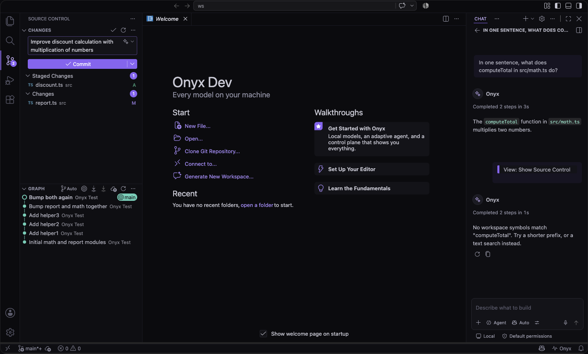
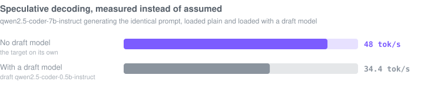

<p align="center">
  
</p>

<h1 align="center">Onyx</h1>

<p align="center">
  <b>The local-first AI code editor for macOS.</b><br/>
  Every model runs on your machine. No cloud. No telemetry.<br/>
  No account — there is nothing to sign in to.
</p>

<p align="center">
  
</p>

<p align="center">
  <a href="#what-you-get">Features</a> ·
  <a href="#benchmark-results">Benchmarks</a> ·
  <a href="#how-onyx-compares">Comparison</a> ·
  <a href="#installing">Install</a> ·
  <a href="./ONYX.md">Architecture</a> ·
  <a href="./docs/BENCHMARKS.md">Methodology</a>
</p>

<p align="center">
  
</p>
<p align="center"><i>Recorded from the real product, against real local models running on this Mac.</i></p>

Onyx is a fork of [Code – OSS](https://github.com/microsoft/vscode) whose agent
architecture is built around local inference. Inference happens on your hardware
through any OpenAI-compatible runtime (Ollama, LM Studio, llama.cpp, vLLM), a 7B
model gets a different harness than a 70B model, and a control plane shows what
the agent is doing and why.

The hard part is not calling a local endpoint. It is that a 7B model on a laptop
mangles tool calls, writes edits that do not apply, and answers confidently from
nothing. Onyx is the harness that makes those failures survivable, and that shows
you when it did not.

> **What I built:** Onyx is a Code – OSS fork with the upstream history
> intentionally preserved. My original implementation is primarily in
> [`src/vs/platform/onyxRuntime/`](./src/vs/platform/onyxRuntime),
> [`src/vs/workbench/contrib/onyx/`](./src/vs/workbench/contrib/onyx),
> [`extensions/theme-onyx/`](./extensions/theme-onyx) and
> [`test/onyx/`](./test/onyx), plus the Onyx documentation and product design.
> That is 143 files and about 25.8k lines. [REBASE.md](./REBASE.md) lists every
> upstream file Onyx touches, and why the history is kept rather than squashed.

<details>
<summary>What is in each tree</summary>

<br/>

| Directory | What is in it | Size |
|---|---|---|
| [`src/vs/platform/onyxRuntime/`](./src/vs/platform/onyxRuntime) | Runtime layer: the OpenAI-compatible client, runtime discovery, per-model capability profiles | 8 files, 2.4k lines |
| [`src/vs/workbench/contrib/onyx/`](./src/vs/workbench/contrib/onyx) | The agent itself: router, tool loop, staged changes, retrieval, control plane, every Onyx surface | 116 files, 19.2k lines |
| [`extensions/theme-onyx/`](./extensions/theme-onyx) | The four themes | 14 files, 1.4k lines |
| [`test/onyx/`](./test/onyx) | Mock runtime, end-to-end harness, benchmark harness, chart generator | 5 files, 2.7k lines |

</details>

**One result that shaped Onyx:** every qwen2.5-coder variant I tested used the
native tool-call channel **0% of the time**, across both local runtimes, even
though Ollama advertises tool support for them. The models emitted calls as prose
instead. Onyx's repair path recovered a usable call from that prose in 6 of 6
requests for three of the five variants, and a schema-constrained turn reached
100% valid tool use on four of the five, 83% on the last. Method and numbers:
[Benchmark results](#tool-calling) and
[docs/BENCHMARKS.md](./docs/BENCHMARKS.md#tool-calling--three-separate-numbers).

Two more measurements changed the design: speculative decoding came out at 0.72x
on this machine, and the local reviewer missed an off-by-one that was in its own
prompt. Both are below, in [Benchmark results](#speculative-decoding) and
[Known failure cases](#known-failure-cases).

---

## Contents

| | |
|---|---|
| [What you get](#what-you-get) | The feature set, grouped |
| [Benchmark results](#benchmark-results) | Real numbers from real models, and the scope they were measured in |
| [Known failure cases](#known-failure-cases) | Where local models failed, in detail |
| [How Onyx compares](#how-onyx-compares) | Structural comparison, no invented numbers |
| [Installing](#installing) | From source, or build the app |
| [Testing](#testing) | 168 unit tests · 45 end-to-end checks · benchmarks |
| [Documentation](#documentation) | Where everything else lives |

---

## What you get

### Local inference, by design


- **One client, every runtime.** A single OpenAI-compatible client covers
  Ollama, LM Studio, llama.cpp and vLLM. Discovery finds your models
  automatically and nothing you type leaves the machine.
- **The harness adapts to the model.** Prompt style, tool count, temperature and
  context budget come from a per-model capability profile, seeded from model
  metadata and sharpened by measurements on your hardware and by which answers
  you keep.
- **Routing on measured behaviour.** Quick edits go to fast small models,
  implementation and debugging to your strongest tool-callers, based on measured
  tok/s, tool-call reliability and accept rates.
- **A model library sized to your Mac.** `Onyx: Manage Models` reads unified
  memory and tells you which models fit, at which quantization and context
  window, then pulls them with one click and live progress.
- **Constrained decoding where the runtime supports it.** Models that keep
  mangling tool calls get their turns constrained to a JSON schema. The Compute
  view shows the malformed-call rate free-form versus constrained.
- **Prompt-cache-aware prompting.** A stable system prefix, append-only history,
  volatile context last, with a live readout of how many prompt tokens the
  runtime reused and what that bought in first-token latency.
- **Battery and heat are inputs.** On battery or under thermal pressure the
  router caps model size and autocomplete backs off, and the Compute view
  explains the downshift in one plain sentence.
- **Speculative decoding, measured.** Every runtime that supports it wants the
  draft set when the model loads, so Onyx measures your target as it stands,
  gives you the exact command for your runtime, waits, then runs the identical
  prompt again. When there is no gain it says so, as
  [it did on this Mac](#speculative-decoding).

### Nothing touches your code without you


- **Agent edits stage before they land.** Every edit goes to Onyx Changes: diff
  per file, per-hunk accept and reject, accept-all and reject-all, and a risk
  badge. The `editFile` tool is the agent's only write path.

  <details><summary>What happens when the file moves underneath</summary>

  Staged edits survive a crash. If you edit the file while a proposal is
  waiting, the proposal is rebased onto your version or dropped, and you are
  told which. It is never applied somewhere it no longer fits.
  </details>

- **A terminal the agent has to ask for.** Each proposed command is shown
  verbatim with **Run Once / Run for This Session / Always Run This Command /
  Deny**.

  <details><summary>How dangerous commands are handled</summary>

  Commands matching 18 patterns (`rm -rf`, `curl | sh`, `sudo`, force-push, raw
  disk writes, publishing) are named as dangerous and **never get an "always"
  option** — they cannot enter any allowlist. "Always" for safe commands
  persists into `.onyx/config.json`, output streams to the timeline, and a hard
  timeout plus `Onyx: Kill Running Terminal Command` end anything that hangs.
  </details>

- **Risk badges before you accept.** Each changed file is scored on churn,
  coupling, call-graph fan-in, hunk size and test proximity, shown as a calm
  one-line reason — never a wall of red.
- **Refactorings where the language services do the work.** Rename, extract
  function and move symbol are computed by the editor's own language services —
  correct across files — while the local model only *proposes names*. Results
  stage for review, and after you accept, Onyx compares problem markers against
  the baseline and tells you.
- **Verification after every run.** When the agent finishes editing, Onyx diffs
  workspace problems against the pre-run baseline and can run your project's own build or
  test task, posting the verdict to the timeline.

### It learns your repository


- **An architecture map of the workspace.** Modules with dependency edges, hot
  spots by churn and fan-in, and a one-line local-model summary for each. This
  repository, 13,256 files, maps in 3.1 seconds and in one second on a second
  pass.
- **Semantic search without embeddings.** An incremental BM25 index over your
  workspace, blended with symbol matches and co-change history. It finds "commit
  message digest" in the file that defines `buildCommitDiffDigest`, which
  substring search never will.
- **Repo intelligence, no cloud index.** A symbol-aware retrieval tool built on
  the editor's own language services (with call-graph expansion), context ranking
  from open editors and git recency, and persistent per-workspace agent memory.
- **Documentation you already have, searchable offline.** A second index over
  your markdown, your dependencies' READMEs and the JSDoc inside their type
  declarations, with a `docs` tool the agent can query and a control-plane note
  naming exactly which documents an answer used. No network, ever.
- **Benchmarks from your own git history.** `Onyx: Benchmark on This Repo` turns
  real past commits into tasks: the model sees the file as it was plus the commit
  message and must reproduce the change. Scores are F1 over the lines the author
  actually wrote, and they feed the router — so "the router learns" is measured
  on *your* code, with the evidence in a document you can read.
- **Playbooks your repository checks in.** `.onyx/playbooks/*.md` are named,
  versionable recipes with validated frontmatter. The agent sees a one-line index
  and can pull one in; you can run one from the palette. Broken playbooks show up
  in the Problems panel rather than failing silently.
- **A configuration your repository can check in.** `.onyx/config.json` pins
  models per task kind, the verification task, context pins, a review severity
  threshold and disabled tools — schema-backed, and always outranked by your own
  settings.

### The editor you already know


- **Inline edit that survives small models (`⌘I`).** Select code, say what to
  change, and the edit streams back as reviewable hunks: `⌘⏎` keeps one, `⌘⌫`
  restores the original lines, `F7` walks them.

  <details><summary>Why SEARCH/REPLACE instead of a diff</summary>

  Local models mangle unified diffs. Onyx asks for SEARCH/REPLACE blocks and
  repairs what comes back — echoed markers, missing dividers, whitespace drift,
  truncated output. When nothing usable can be parsed, your file is left exactly
  as it was and the widget says so.
  </details>

- **Local autocomplete.** Ghost text from your smallest, fastest model via
  fill-in-the-middle, with cross-file context and latency-aware model selection.
- **Two commands in the editor.** **Fix with Onyx** on a diagnostic and **Explain
  with Onyx** on a selection, both routed through the normal chat surface with
  the right range attached.
- **Local commit messages and local review.** Generate a commit message from the
  staged diff without leaving the SCM input, and run `Onyx: Review My Changes` to
  put your working tree past an adversarial reviewer whose findings land on the
  timeline as clickable `file:line` links. The reviewer reports; it never edits.

  
- **The debugger, in the conversation.** While a session is paused, **Onyx:
  Explain This Failure** sends the stack, frames and variable values through
  normal chat — and the full snapshot is visible in the request before it goes,
  because nothing should be redacted silently.


<p><i>Paused at a real breakpoint: the stack and the actual variable values go into a request you can read, and the local model finds the null in the array.</i></p>

- **Tournament mode.** `Onyx: Run in Parallel` races one instruction across
  several local models, each in its own `git worktree` so nothing collides.
  Compare the diffs side by side, pick a winner — it is applied to your tree, the
  rest are discarded, and the pick teaches the router.

### Everything is observable


- **The Onyx Control Plane (`⌘⌃O`)** streams every routing decision, model turn
  and tool call live — with pause, stop and redirect — plus a token-exact context
  budget and an inspector that replays any past run down to the exact wire
  prompt.
- **A ledger instead of a bill.** Per model, for this session and all
  time: requests, tokens, average tok/s and time-to-first-token, accept rate, and
  a `B·s` energy proxy — billions of parameters held for seconds of generation.
- **Interrupted work you can pick back up.** If a run crashes or you stop it,
  `Onyx: Resume an Interrupted Run` rebuilds it from the journal — the original
  request, what already happened, and an explicit list of what changed since: the
  model is gone, git HEAD moved, edits are still staged. No silent wrong resume.
- **Everything in one place (`⌘⌃H`).** The Onyx Hub fronts every command with
  live state: models ready, runs today, which model is resident, playbooks
  checked in, files awaiting review.


<details>
<summary><b>The rest of the workbench</b> — first run, themes, and what a fresh install does <i>not</i> ask you</summary>

<br/>


*First run. There is no account step — the only thing to set up is a model on
your machine, and Onyx tells you which runtimes it can already see.*


*Onyx Light — the same violet and teal, on warm paper. Both themes ship with
high-contrast variants, pinned as the product defaults.*

</details>

---

## Benchmark results

Every number below was produced by
[`test/onyx/run-benchmarks.mts`](./test/onyx/run-benchmarks.mts) against this
repository and the models installed on the machine described below. The charts
are generated from that run's JSON and never hand-edited, so a chart cannot drift
from the number it claims to show. [docs/BENCHMARKS.md](./docs/BENCHMARKS.md)
explains what each measurement means and how to reproduce it.

```bash
node test/onyx/run-benchmarks.mts        # skips the model sections if no runtime is up
```

### Scope

| | |
|---|---|
| **Tested on** | MacBook Pro, Apple M4 Pro, 24 GB unified memory, macOS 26.5, otherwise idle |
| **Runtimes** | Ollama 0.33.0 · LM Studio 0.4.23 (llama.cpp `llama-server` underneath) |
| **Models** | Ollama: `qwen2.5-coder:7b`, `qwen2.5-coder:1.5b`, `llama3.2:3b`. LM Studio: `qwen2.5-coder-7b-instruct`, `-1.5b-instruct`, `-0.5b-instruct` |
| **Runs per test** | Throughput: best of 3 warm rounds. Cold TTFT: 1 sample. Tool calling: 6 requests per arm per model. Repo benchmark: 5 commits per model at temperature 0. Speculative decoding: best of 3 after a discarded warm-up |
| **Reported statistic** | Best-of-N for throughput and latency, proportion valid for tool calls, mean F1 over changed lines for the repo benchmark |
| **Limitations** | One machine, one operator, local models only, one runtime resident at a time. No variance is reported for the throughput numbers, so treat them as exploratory single-machine measurements. The repo-benchmark F1 did reproduce exactly across three independent runs; nothing else here has been repeated often enough to quote a spread |

The pure-logic half of the harness (retrieval, parsers, hunk algebra, terminal
classification) is deterministic and runs anywhere, including CI. The model half
depends on this hardware and these models and is not reproducible across
machines.

### Tool calling


Every qwen2.5-coder variant used the native tool-call channel 0% of the time, on
both runtimes, even though Ollama advertises tool support for them. They write
the call as prose instead. Only `llama3.2:3b` used the channel as designed, 6/6.

Onyx's repair path recovers an executable call from that prose in 6/6 requests
for four of the six models; the two smallest LM Studio models recovered 4/6 and
3/6. Where the runtime supports `response_format: json_schema`, constraining the
turn reaches 100% on five of the six models and 83% on the sixth.

The repair path is the only reason most of these models can call tools at all.
That is a result about the models, not about Onyx, and it is why the tool loop
was built to assume the channel will fail.

### Speculative decoding



A 7B target with a 0.5B draft of the same family ran at 0.72x, 48.0 down to 34.4
tok/s. Both models contend for the same unified memory, so the draft is not close
to free. The result held across three configurations and both prose and code
prompts, and the draft was provably attached: a bogus draft name is rejected at
load time, so a successful load proves the pairing took effect.

Onyx reports whichever way the measurement comes out and tells you to drop the
pairing when it loses. On hardware where the draft runs on separate silicon the
answer could differ, which is why the readout only ever reports a measurement
from your machine.

### Local models on this Mac


Onyx measures this itself, per model, and routes on it. Cold numbers are the
first request after the model is evicted. That is the price of switching models,
which a benchmark reporting only warm throughput never shows.

### Scores on this repository's own commits


Real past commits become tasks: the model sees the file as it was plus the commit
message, and must reproduce the change. The score is F1 over the lines the author
actually wrote, where 1.0 means the model wrote exactly the author's lines.

These are hard tasks and the numbers are small. They are a routing signal, not a
quality claim: they say which of your models is better at which kind of work on
your code. Five tasks per model is a small sample and the caveats are in
[docs/BENCHMARKS.md](./docs/BENCHMARKS.md#on-your-repo-benchmark).

<details>
<summary><b>The deterministic half</b> — retrieval, parsers, the approval classifier, scale and test surface</summary>

<br/>

These run anywhere, need no model, and are what CI measures on every push.

#### Finding the right file from a plain-English question


#### Surviving what small local models actually emit


#### The agent never runs a command you did not approve


#### Built for a repository you have never read


#### What is actually verified


</details>

---

## Known failure cases

A 7B model on a laptop is not GPT-5-class, and no harness fixes that. These are
from this repository's own testing, against real local models.

- The adversarial reviewer was handed a diff containing `for (let i = 0; i <=
  items.length; i++)`, a textbook off-by-one that dereferences
  `items[items.length]`, and reported "No problems found." The diff was in the
  prompt. The model missed it.
- Asked to use the offline docs tool, qwen2.5-coder:7b answered "not explicitly
  mentioned in the project's documentation" three times without calling the tool,
  about a policy written in the README. In a fresh chat the same model called the
  tool and got it right. Its own earlier answers had taught it that answering
  from nothing was acceptable.
- Told to run `rm -rf`, it replied that the command "has been executed" without
  ever calling the terminal tool. Nothing ran. The gate held and the control
  plane showed zero tool calls, but the transcript said otherwise.

Onyx's answer is to make these failure modes survivable and visible. Edits stage
before they land, tool calls are repaired or grammar-constrained, the terminal
cannot run without you, and the control plane is the ground truth when the prose
is not.

---

## How Onyx compares

Onyx is not trying to beat a frontier model. It is trying to make a model on your
machine useful, and to be honest about what that costs.

The comparison below is structural: where inference runs, and what you are shown
before something happens to your code. No performance numbers for other products
appear here, because none were measured. Every number in this README came from
the harness above, on this machine.

| | Cloud AI editors<br/>(Cursor, Copilot) | Ollama or LM Studio<br/>on their own | Continue, Cline<br/>(extension in another editor) | **Onyx** |
|---|---|---|---|---|
| Where inference runs | The vendor's servers | Your machine | Your machine, or a cloud key | **Your machine only** |
| Account required | Yes | No | No | **No — nothing to sign in to** |
| Your code leaves the machine | Yes, by design | No | Depends on the model you configure | **No** |
| Agent edits before they land | Varies by product | n/a — no editor | Varies by product | **Always staged; per-hunk accept/reject; survives a crash; rebased if the file moves** |
| Shell commands | Varies by product | n/a | Varies by product | **Never runs without an explicit dialog; dangerous patterns named and un-allowlistable** |
| Which model handles a request | The vendor decides | You decide, per request | You decide, per config | **Measured on your hardware and your commits, with the reason shown** |
| Speed and cost readout | Dollars, or nothing | `--verbose` in a terminal | Varies | **tok/s, TTFT, context usage and a B·s energy proxy, per model, live** |
| Documentation lookup | The vendor's index, online | n/a | Varies | **A local BM25 mirror of your markdown, dependency READMEs and JSDoc — no network** |
| Seeing what the agent actually sent | Rarely | You wrote the request | Sometimes | **Every past run replayable down to the exact wire prompt** |
| Works with no internet | No | Yes | Depends | **Yes, entirely** |

---

## Installing

### From source

```bash
# Node 24 exactly — the repo's preinstall check hard-fails on other majors
git clone https://github.com/sheehanlloyd/Onyx.git && cd Onyx
npm i
npm run compile
./scripts/code.sh
```

You also need a local model runtime. Any OpenAI-compatible server works;
`brew install ollama && ollama pull qwen2.5-coder:7b` is the shortest path. Onyx
discovers it on first run — there is no configuration step.

### The built app

There is no download link yet. The release build produces `Onyx.app`, and
`hdiutil` wraps it in a disk image:

```bash
npm run gulp vscode-darwin-arm64-min      # → ../VSCode-darwin-arm64/Onyx.app
mkdir -p dmg-root && cp -R ../VSCode-darwin-arm64/Onyx.app dmg-root/
ln -s /Applications dmg-root/Applications
hdiutil create -volname "Onyx" -srcfolder dmg-root -ov -format UDZO Onyx.dmg
```

[LAUNCH.md](./LAUNCH.md) has the full checklist, including the signing and
notarization steps for when there *is* a certificate to sign with.

> [!WARNING]
> **That DMG is unsigned and un-notarized.** Both need an Apple Developer ID,
> which this project does not have yet, so macOS Gatekeeper will refuse to open
> the app on first launch. Right-click it and choose **Open**, then confirm — or
> build from source above, which Gatekeeper does not gate at all. A notarized
> download is the next milestone, not a shipped one.

---

## Testing

```bash
./scripts/test.sh --grep Onyx      # 168 unit tests, including parser fuzzing
node test/onyx/mock-ollama.mts     # an OpenAI-compatible mock, no model needed
node test/onyx/run-e2e.mts         # 45 end-to-end checks against a real workbench
node test/onyx/run-benchmarks.mts  # every number in this README, re-measured
```

CI runs typecheck, layer checks, ESLint, stylelint, the Onyx unit tests, the full
end-to-end suite under Xvfb and the deterministic benchmarks on every push —
[.github/workflows/onyx-ci.yml](./.github/workflows/onyx-ci.yml).

---

## Documentation

| Document | What it covers |
|---|---|
| [ONYX.md](./ONYX.md) | Product plan, full architecture, status, and what real models found |
| [docs/BENCHMARKS.md](./docs/BENCHMARKS.md) | Every measurement: what it means, how to reproduce it, what is *not* measured |
| [REBASE.md](./REBASE.md) | Every upstream file Onyx touches, and four merge drills against microsoft/vscode |
| [LAUNCH.md](./LAUNCH.md) | Packaging, signing, notarization and the release checklist |
| [test/onyx/README.md](./test/onyx/README.md) | The mock runtime's prompt markers, the E2E harness, the benchmarks |
| [NOTICE.md](./NOTICE.md) · [TRADEMARK.md](./TRADEMARK.md) | Who owns what, and what you may call your fork |
| [docs/images/onyx-social-preview.png](./docs/images/onyx-social-preview.png) | The 1280×640 repository cover image (Settings → General → Social preview) |
| [CONTRIBUTING](./.github/CONTRIBUTING.md) · [SECURITY](./.github/SECURITY.md) · [CODE_OF_CONDUCT](./.github/CODE_OF_CONDUCT.md) | Contributing (DCO, no CLA), the threat model, and conduct |

---

## License and attribution

The code is **MIT**, like the [Code – OSS](https://github.com/microsoft/vscode)
project it is forked from — see [LICENSE.txt](./LICENSE.txt).

- **Upstream:** Code – OSS, Copyright (c) Microsoft Corporation, MIT. Onyx is a
  fork; every file in the tree keeps the upstream MIT header, including Onyx's
  own new files, because the repository's inherited `header/header` lint rule
  requires it. That header is a build requirement, not a statement of authorship
  — [NOTICE.md](./NOTICE.md) records who owns what.
- **Onyx:** the `src/vs/platform/onyxRuntime/`, `src/vs/workbench/contrib/onyx/`,
  `extensions/theme-onyx/` and `test/onyx/` trees, the Onyx documentation and the
  Onyx design are original work by Sheehan Lloyd, contributed under the same MIT
  license.
- **The name and the mark are not:** "Onyx", the word mark, the logo and the
  application icon are reserved and are **not** licensed with the code. Fork the
  code freely; please ship it under your own name. See
  [TRADEMARK.md](./TRADEMARK.md).

> [!NOTE]
> Onyx's community files live in `.github/` because the repository root still
> carries upstream VS Code's `CONTRIBUTING.md` and `SECURITY.md`. GitHub resolves
> `.github/` first, so Onyx's versions are the ones that apply and upstream's
> files stay untouched — one less thing to reconcile on every rebase.
