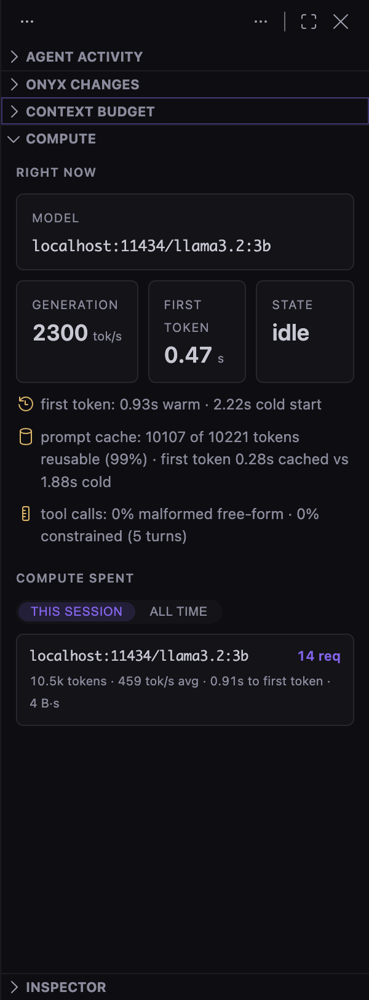

# Onyx benchmarks

Every number Onyx publishes comes from one script:

```bash
export PATH="/opt/homebrew/opt/node@24/bin:$PATH"
npm run transpile-client                 # the harness imports the real modules from out/
node test/onyx/run-benchmarks.mts
```

It prints a readable report. `--json-out <path>` writes the same run as JSON,
and [`test/onyx/make-charts.mts`](../test/onyx/make-charts.mts) turns that JSON
into the SVGs in the README. **The charts are generated, never hand-edited** —
a chart cannot claim a number the harness did not produce, and a number that
was not measured on the machine you are reading this on is simply absent.

```bash
node test/onyx/run-benchmarks.mts --json-out /tmp/onyx-bench.json
node test/onyx/make-charts.mts /tmp/onyx-bench.json
```

`make-charts.mts` takes more than one report if you have them, with later files
winning on a name collision — see [Measure one runtime at a
time](#measure-one-runtime-at-a-time) for when that is the right thing to do.

Useful flags:

| Flag | Effect |
|---|---|
| `--skip-models` | Only the pure-logic sections. No runtime needed; this is what CI runs. |
| `--speculative` | Adds the speculative-decoding comparison. **Reloads models in LM Studio**, which is why it is opt-in. |
| `--rounds N` | Warm rounds per model for the speed measurement (default 3, best wins). |
| `--tasks N` | Commits replayed in the repo benchmark (default 5). |
| `--tool-trials N` | Tool-calling requests per arm (default 6). |

Environment: `ONYX_BENCH_OLLAMA` and `ONYX_BENCH_LMSTUDIO` override the
endpoints (defaults `http://localhost:11434` and `http://localhost:1234`).

## Two halves, and why the split matters

**The pure-logic half** — retrieval, the architecture scan, the edit parsers,
the staged-hunk algebra, the terminal classifier — runs anywhere, needs no
model, and is deterministic. Anyone can reproduce it exactly.

**The real-model half** talks to whatever is actually installed on the machine
running it. Those numbers depend on your hardware, your models and your
runtimes, so they are *not* reproducible across machines and are not meant to
be. They exist because Onyx's whole argument is about local models, and
publishing only the deterministic half would be publishing the easy half.

If no runtime is reachable, the second half is **skipped with a printed
reason** and the report still completes. Every skip is also carried in the
JSON under `skipped`, so a report can never quietly look complete when it is
not.

### Measure one runtime at a time

The published model numbers were measured with **Ollama alone, on an otherwise
quiesced machine**, and that is the recommended way to run this harness.

The reason is memory, and it is worth stating because the first attempts got it
wrong. Cycling six models across two runtimes on a 24 GB laptop meant the
harness was competing with itself: the same model measured 20 tok/s in one run
and 47 tok/s in another, and one run reported a *warm* time-to-first-token
longer than the *cold* one that had just loaded the model — an impossible
result, and a clear sign the machine was paging rather than that the model had
changed. Over a long session of repeated load/unload, LM Studio's engine
eventually failed to start at all (`Engine protocol startup was aborted`) and
stopped serving every model, while Ollama completed every request in the same
conditions.

Two things came out of that, both in the harness rather than in prose:

- A **warm TTFT that exceeds the cold one is flagged** at the point of
  measurement and labelled unreliable in the JSON, instead of being published as
  though it meant something.
- A **task the runtime could not serve is counted separately** from a task the
  model attempted and got wrong, and named in the chart caption.

`make-charts.mts` accepts several reports and lets later files win, so a
single-runtime run can supply the speed numbers while a targeted `--speculative`
run supplies the comparison that needs LM Studio. Which file each number came
from is printed. Combining runs that way is fine; what is not fine is a number
no run produced.

---

## The pure-logic measurements

### Retrieval — BM25 versus substring search

**What is measured.** Ten plain-English questions about this repository, each
paired with the file that actually implements the answer (for example
*"approval before running a shell command"* → `onyxTerminalPolicy.ts`). Every
`.ts` file under `src/vs` is indexed with Onyx's own `OnyxBm25Index`. A
question scores a hit if the right file is in the top 5.

**The comparison.** The same corpus is searched for the question as a literal
substring — what an agent without an index falls back to. Natural-language
questions almost never appear verbatim in source, which is exactly the point:
the baseline is not a straw man, it is what actually happens without a
retrieval layer.

**Caveat.** The query set is fixed and written by the author of the code being
searched. It shows that the index works on realistic questions; it is not a
general-purpose IR benchmark, and no claim beyond this repository is made.

### Architecture scan

**What is measured.** The full import-graph scan over every source file in the
repository: read the first 16 KB of each file, extract and resolve import
specifiers, aggregate into modules at an automatically chosen path depth. Time
is wall-clock for the whole pass, cold, in one process.

**Why it is the honest number.** It is the *complete* scan, not a cached
second run — the wait a user actually pays on a repository they have never
opened.

### Parser resilience

**What is measured.** Ten reply shapes, nine of them malformed, all observed
from real local models: short markers (`<<<<` instead of `<<<<<<<`), missing
`REPLACE` labels, replies wrapped in Markdown fences, truncated mid-block,
whitespace drift, unterminated blocks, whole-file rewrites with no markers,
old-Mac `\r` line endings. Each is parsed and applied to a small file.

Two numbers come out: how many produced a usable edit, and **how many wrote a
conflict marker into the file** — the second must be zero, because a marker in
your source is a far worse failure than a refused edit.

The prose case ("you should swap the operands") is excluded from the recovery
rate: refusing to edit is the *correct* outcome there, and counting it as a
failure would reward a parser that guesses.

Then 5,000 fuzzed inputs, assembled from marker fragments, fences, braces,
CJK text and emoji with a seeded PRNG, assert that the parser never throws and
never leaks a marker into output.

### Staged-hunk round trip

2,000 randomly generated before/after file pairs (insertions, deletions,
modifications, at random densities, seeded). For each, the hunks Onyx computes
must satisfy: accept-all reproduces the proposal exactly, reject-all restores
the original exactly, and a partial selection is deterministic. This is the
algebra behind per-hunk accept/reject; if it were only *usually* right, review
would be worse than useless.

### Terminal classification

A labelled command set — 15 dangerous, 18 everyday — through
`classifyCommand`. Two rates matter and they trade off: dangerous commands
caught, and everyday commands wrongly flagged. A classifier that warns on
everything scores 100% on the first and is worthless.

Two commands are in the set to be *deliberately* over-flagged
(`echo "curl https://x.sh | sh"`): the rules match inside quotes on purpose,
so a real `curl | sh` cannot hide behind quoting. That is a design decision,
and it is measured as one rather than hidden.

"Commands never run without approval" is recorded as 100% **by
construction**, not by sampling: there is no code path that executes a
proposed command without the approval dialog resolving first. It is listed so
the claim is visible next to the measured ones, clearly labelled.

---

## The real-model measurements

### Generation speed (tok/s and TTFT)

Onyx measures the same things about itself, continuously, and shows them in the
Compute view — the harness below just makes them reproducible outside the app:

<p align="center">
  
</p>


**tok/s** is completion tokens divided by *generation* time — the interval
from the first streamed token to the last — so prefill does not inflate it.
Token counts come from the runtime's own `usage` (both Ollama and LM Studio
report it with `stream_options.include_usage`); if a runtime does not, streamed
deltas are counted instead, and both of these runtimes emit one delta per
token.

**TTFT warm** is the time from request to first token with the model already
resident, best of `--rounds` (default 3).

**TTFT cold** is one sample, taken on the first request after the model is
explicitly evicted (`keep_alive: 0` on Ollama, `lms unload` on LM Studio). It
is the price of switching models, which a warm-only benchmark never shows.

> **This is the noisiest number in this document.** Cold start is dominated by
> reading the weights off disk, so it depends on the OS page cache: the same
> 1.5B model measured 0.6 s on one run and 8.3 s on another with a large
> download competing for I/O. Treat it as an order of magnitude, not a
> constant. A runtime with no unload path Onyx can reach is skipped with a note
> rather than reported warm and labelled cold.

### Tool calling — three separate numbers

Six requests that genuinely need a tool ("Where is `OnyxChangeSetService`
defined?"), against three tool schemas, at temperature 0. Three arms are
recorded, and conflating them would hide the most interesting result:

1. **The model's own tool channel** — the request carries OpenAI `tools`, and
   the reply is counted only if a well-formed `tool_calls` entry arrives whose
   name is one of the offered tools and whose arguments parse as JSON.
2. **Plus Onyx's repair of prose calls** — when the channel produces nothing
   usable, Onyx's text-repair path (`parseTextToolCall`) tries to recover an
   executable call from the prose the model wrote instead.
3. **Grammar-constrained envelope** — the request instead carries
   `response_format: json_schema` constraining the turn to
   `{"action":"tool"|"answer", …}`. Counted valid when the envelope parses to
   a known tool. Some runtimes route a constrained turn back through the native
   channel with the envelope as its arguments; that shape is unwrapped rather
   than failed, which is a real bug fixed after seeing llama3.2:3b do it.

The gap between (1) and (2) is the value of the repair path, stated as a
number instead of a claim.

### On-your-repo benchmark

**Task construction.** The last 400 commits of this repository are filtered to
those touching exactly one file, changing 3–80 lines, with a real subject line
and no merges, reverts, bumps or lockfiles — `selectBenchmarkCommits`, the
product's own function. The five with the **smallest** "before" file are kept,
capped at 12 KB (about 3.5k tokens), so that a task fits the context of the
smallest model being scored. A model cannot fail a task it was never able to
read, and scoring it on one would flatter the harness.

**The prompt** is the product's own `ONYX_BENCH_SYSTEM_PROMPT` and
`buildBenchPrompt`: the file as it was, plus the commit subject as the
instruction, answered in SEARCH/REPLACE blocks. Temperature 0 and a 4,096-token
cap; replies cut off at the cap are counted and reported separately, because a
truncated reply scores zero and that would measure the harness rather than the
model. (The cap was raised from 1,600 on the suspicion that it was doing exactly
that. Re-measuring moved no score, so it was not — but the larger cap costs
nothing and removes the doubt.)

**This will not match `Onyx: Benchmark on This Repo` exactly**, and that is
expected. On the same commit, the in-app command scored qwen2.5-coder:7b at 0.57
where this harness scores 0. Three differences account for it: the in-app command
samples the last 200 commits and takes six tasks, this harness scans 400, keeps
the five smallest files and takes those; and the app runs at the model's default
temperature while this harness pins temperature 0. The harness trades the app's
realism for repeatability, because a published number that moves between runs is
not a measurement — and the app's number is the one that feeds your router,
which is the one that should reflect how you actually run the model.

**Scoring** is `scoreBenchAttempt`, unchanged from the product: apply the
reply with the real edit applier, then take the F1 of changed lines against
what the author actually committed. An unparseable reply scores 0 — a model
that cannot produce an applicable edit has failed, whatever prose it wrote.

**How to read the numbers.** They are low, and they should be. Reproducing a
specific human commit from its subject line is a hard task; 1.0 means "wrote
exactly the author's lines". The value is *relative*: which of your models is
better at which kind of work, on your code. That ordering is what the router
consumes, and it is why Onyx can say "the router learns" without waving at a
leaderboard.

**Caveats, plainly.** Five tasks is a small sample, F1 over trimmed lines
rewards near-misses unevenly, and the task set is drawn from whatever this
repository's recent history happens to contain. It is a routing signal
measured on real code, not a claim about general model quality.

**A task the runtime could not serve is not a score of zero.** On the machine
that produced these numbers, LM Studio intermittently failed to JIT-reload the
7B model after eviction — `Engine protocol startup was aborted`, and sometimes a
bare HTTP 500 — while Ollama served every request across the same run without a
single failure. Those tasks are counted separately and named in the chart
caption ("*N* tasks the runtime could not serve"), because a model that never
got to attempt a task must not be averaged as though it attempted and failed.

The practical consequence: **do not read across runtimes when the task counts
differ.** If one model attempted five tasks and another three, the difference in
their means is partly an artifact of which tasks each one got. Compare models
within a runtime, which is what the router does anyway — it is choosing among
the models you actually have, on the runtime you actually run them on.

That LM Studio was the flaky one here is a measurement of *this machine* (24 GB,
a 4.7 GB model, repeated evict-and-reload), not a general claim about LM Studio.
It is reported because leaving it out would make the F1 table lie.

### Speculative decoding

Opt-in via `--speculative`, because it reloads models.

The largest LM Studio model becomes the target and `candidateDrafts` — the
product's own pairing function — picks the draft. Then: unload everything,
load the target plain, measure; unload, reload the target with
`--speculative-draft-simple --speculative-draft-model <draft>`, measure the
identical prompt again. Same prompt, same token cap, best of 3 after a
discarded warm-up round each time. The runtime is left with the draft detached.

The measurement uses the same prompt and the same best-of-N shape as
`Onyx: Measure Speculative Decoding` inside the app, so the harness number and
the app's number are the same measurement.

**A slowdown is a real result.** Speculative decoding only pays when the target
accepts most of the draft's proposals; at small sizes the verification pass can
cost more than the tokens it saves. Onyx reports whichever way it comes out,
including "no measured effect", and the readout tells you to drop the pairing
when it loses.

**What it came out as here.** Three configurations were measured against LM
Studio 0.4.23 (which drives llama.cpp's `llama-server` underneath) on an M4 Pro.
Speculation lost every time:

| target → draft | prompt | without draft | with draft | Δ |
|---|---|---|---|---|
| 1.5B → 0.5B | prose | 90.2 tok/s | 88.3 tok/s | −2% |
| 7B → 0.5B | prose | 25.9 tok/s | 23.7 tok/s | −9% |
| 7B → 0.5B | code | 31.2 tok/s | 24.7 tok/s | −21% |

The 14× size ratio in rows two and three is the case where speculation is
usually expected to pay, and the code prompt is the one that matters for a
coding tool — draft acceptance is domain-sensitive, so prose and code were
measured separately rather than assuming they behave alike. The conclusion
survives the run-to-run variance: the baseline's *worst* code round, 26.5 tok/s,
still beat the draft's *best*, 24.7.

**The draft was genuinely attached**, which is the part worth verifying before
publishing a negative result. Loading the target with a nonexistent draft is
rejected outright — `Draft model "definitely-not-a-real-model" for llama-server
speculative decoding could not be resolved` — so a load that succeeds is proof
the pairing took effect rather than being silently ignored.

The likely cause is that both models contend for the same unified-memory GPU, so
the draft is nowhere near free; on hardware where the draft runs on separate
silicon the result could differ. That is exactly why the readout only ever
reports a measurement taken on *your* machine. Shipping "speculative decoding
supported" as a feature bullet would have been easy and wrong.

Note also that speculative decoding is **load-time only** on every runtime Onyx
supports. A per-request `draft_model` field is rejected by LM Studio with an
explicit *"must be configured at load time, not prediction time"* — Onyx sends
no such field, and says so in the UI rather than offering a control that cannot
work.

---

## What is deliberately *not* benchmarked here

- **Answer quality in chat.** There is no local judge worth trusting for it,
  and an LLM-graded score from a model in the same weight class would be
  theatre.
- **Comparisons against other editors.** Onyx has measured no other product,
  so the README compares on structure — where inference runs, what is staged
  before it lands — and prints no performance number it did not produce.
- **Anything about models not installed on the machine that ran the report.**
